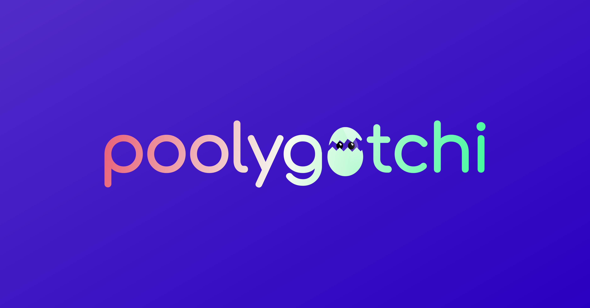

# Poolygotchi

## A gamified interface for the PoolTogether protocol.

## Installation

1. Clone or fork this repo and run `npm i`.
2. Install solidity dependencies by entering the solidity folder with `cd src/solidity` and running `npm i`.
3. Compile solidity contracts by running `npx hardhat compile`.

## Development

Follow these steps to setup your development environment:

1. Optionally, open the `scripts/devDeploy.ts` file and update line 20 with your test address to be sent test funds on the local node. (An easier method will be added soon)
2. Navigate back to the root folder.
3. Run `npm run dev` to start the development server.
    - If you'd like to run the development server with the live testnet contracts, use `npm run testnet-dev` instead (`npm run testnet-dev-win` if you are on windows)

## Build

When your app is production ready, run the following command to output the static site files to the `docs` directory:

### Linux

`npm run build`

### Windows

`npm run build-win`
